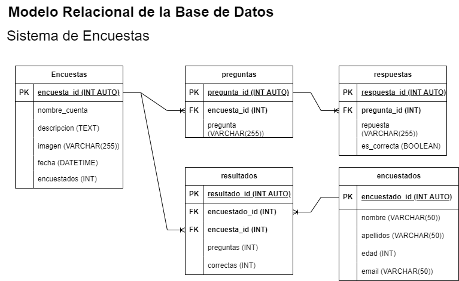

# Encuestas

## Listado de Entidades 

### encuestas **(ED)**

- encuesta_id **(PK)**
- nombre_encuenta
- descripcion
- imagen (logo)
- fecha
- encuestados

### preguntas **(ED)**

- pregunta_id **(PK)**
- encuesta_id **(FK)**
- pregunta

### respuestas **(ED)**

- respuesta_id **(PK)**
- pregunta_id **(FK)**
- respuesta
- es_correcta

### encuestados **(ED)**

- encuestado_id **(PK)**
- nombre
- apellidos
- edad
- email **(UQ)**

### resultados **(ED|EP)**

- resultado_id **(PK)**
- encuestado_id **(FK)**
- encuesta_id **(FK)**
- preguntas
- correctas

## Relaciones

1. Varias **preguntas** provienen de una **encuesta** (M-1)
1. Una **pregunta** tienen muchas **respuestas**(1-M)
1. Un **encuestado** tiene muchos **resultados** (1-M)
1. Una **encuesta** tiene muchos  **resultados**(1-M)

## Diagramas

## Modelo Relacional de la Base de Datos

## Reglas de Negocio

### encuestas 

1. Crear una encuesta.
1. Leer una(s) encuesta(s) dada una condición.
1. Leer todas las encuestas de la tabla encuestas.
1. Actualizar los datos de una encuesta.
1. Eliminar los datos de una encuesta.
1. Aumenar en 1 el valor del atributo encuestados cada vez que un encuestado complete la encuesta.

### preguntas 

1. Crear una pregunta.
1. Leer una(s) pregunta(s) dada una condición.
1. Leer todas las preguntas de la tabla preguntas.
1. Leer las respuestas de una pregunta.
1. Leer las respuestas correctas de una pregunta.
1. Actualizar los datos de una pregunta.
1. Eliminar los datos de una pregunta.

### respuestas

1. Crear una respuesta.
1. Leer una(s) respuesta(s) dada una condición.
1. Leer todas las respuesta de la tabla respuestas.

### resultados

1. Crear un resultado.
1. Leer un(os) resultado(s) dada una condición.
1. Leer todos los resultados de la tabla resultados.
1. Leer los resultados de un encuestado.
1. Leer los resultados de una encuesta.
1. Actualizar los datos de un resultado. 
1. Eliminar los datos de un resultado. 
1. Obtener el porcentaje de acertividad que tuvo el encuestado al contestar la encuesta. 

### encuestados

1. Crear un encuestado.
1. Leer un(os) encuestado(s) dada una condición.
1. Leer todos los encuestados de la tabla encuestados.
1. Actualizar los datos de un encuestado. 
1. Eliminar los datos de un encuestado. 
1. Antes de crear un encuestado en la entidad, verificar mediante su email que no exista.  