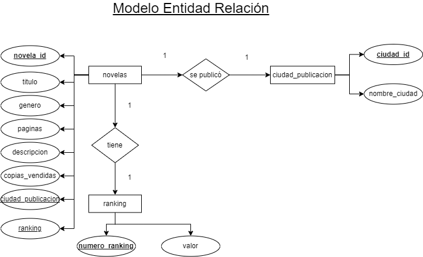

# Base de datos sobre libros de Harry Potter

## Entidades

### novelas

- novela_Id **PK**
- titulo **UQ**
- genero
- paginas
- descripcion
- copias_vendidas
- ranking **FK**
- ciudad_Publicacion **FK**

### rankings (catálogo)
- numero_ranking **PK**
- valor 

### ciudades_publicacion (catálogo)
- ciudad_id **PK**
- nombre_ciudad

## Relaciones

- Una **novela** _tiene_ un **rankings**
- Una **novela** _se publicó_ en una **ciudades_publicacion**

## Diagramas

### Modelo Entidad Relacion

### Modelo Relacional de la Base de Datos

## Reglas de Negocio

### novelas
1. Cada título deberá ser ÚNICO.
1. CREAR un registro en novelas.
1. LEER un(os) registro(s) novela dada una condición.
1. LEER todos los registros de la entidad novelas.
1. ACTUALIZAR los datos de una carrera dada una condición.
1. ELIMINAR los datos de una carrera dada una condición.

### rankings

1. CREAR un registro en rankings.
1. LEER un(os) registro(s) ranking dada una condición.
1. LEER todos los registros de la entidad rankings.
1. ACTUALIZAR los datos de una ranking dada una condición.
1. ELIMINAR los datos de una ranking dada una condición.

### ciudades_publicacion

1. CREAR un registro ciudades_publicacion.
1. LEER un(os) registro(s) ciudad dada una condición.
1. LEER todos los registros de la entidad ciudades_publicacion.
1. ACTUALIZAR los datos de una ciudad dada una condición.
1. ELIMINAR los datos de una ciudad dada una condición.
