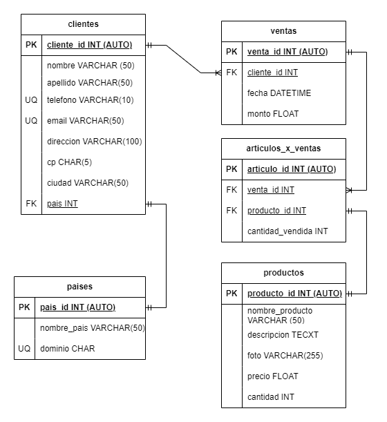

# Ventas

## Listado de Entidades

### clientes **(ED)**
 
- cliente_id **PK**
- nombre 
- apellidos 
- telefono **UQ**
- email **UQ**
- direccion
- cp **UQ**
- ciudad
- pais **FK**

### productos **(EC|ED)**
- producto_id **(PK)**
- nombre_producto
- descripcion
- foto
- precio
- cantidad (stock)

### ventas **(ED)**

- venta_id **PK**
- cliente_id **FK**
- fecha 
- monto 

### articulos_x_venta **(EP)**
- articulo_id **PK**
- venta_id **FK**
- producto_id **FK**
- cantidad_vendida

### paises **(EC)**
- pais_id **PK**
- nombre_pais
- dominio **UQ**

## Relaciones 

1. Un **cliente** _tiene_ **pais**(1-1)
1. Un **cliente** _genera_ **ventas** (1-M)
1. Una **venta** _tiene_ **articulos** (1-M)
1. Un **articulos** _es un_ **producto** (1-1)

## Diagrama Relacional de la Base de Datos

## Reglas de Negocio

### clientes

1. CREAR un cliente en la tabla cliente.
1. LEER un(os) cliente(s) dada una condición.
1. LEER todos los clientes en la tabla clientes.
1. MODIFICAR los datos de un cliente dada una condición.
1. ELIMINAR los datos de un cliente dada una condición. 

### productos

1. CREAR un producto en la tabla productos.
1. LEER un(os) producto(s) dada una condición.
1. LEER todos los productos en la tabla productos.
1. MODIFICAR los datos de un producto dada una condición.
1. ELIMINAR los datos de un producto dada una condición. 
1. Cada que haya una venta, restar a la cantidad de productos disponibles el número de productos que se vendieron.

### ventas

1. CREAR una venta en la tabla ventas.
1. LEER un(as) venta(s) dada una condición.
1. LEER todas las ventas en la tabla ventas.
1. LEER las ventas de un producto en particular.
1. LEER las ventas de un cliente en particular.
1. MODIFICAR los datos de una venta dada una condición.
1. LIMINAR los datos de una venta dada una condición. 

### articulos_x_venta

1. CREAR una artículo en la tabla articulos_x_venta.
1. LEER un(os) artículo(s) dada una condición.
1. LEER todos los artículos en la tabla articulos_x_venta.
1. LEER todos los artículos de una venta en particular.
1. LEER todos los artículos de un producto en particular.
1. LEER todos los artículos de un cliente en partcular.
1. MODIFICAR los datos de un artículo dada una condición.
1. LIMINAR los datos de un artículo dada una condición. 

### paises

1. CREAR una país en la tabla paises.
1. LEER un(os) país(s) dada una condición.
1. LEER todos los país en la tabla paises.
1. MODIFICAR los datos de un país dada una condición.
1. LIMINAR los datos de un país dada una condición. 