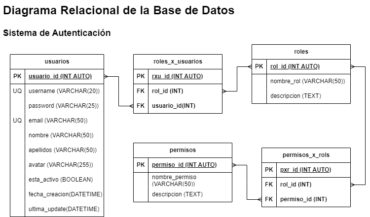

# Sistema de Autenticación

## Listado de Entidades

### usuarios **(ED)**
- usuario_id **(PK)**
- username **(UQ)**
- password
- email **(UQ)**
- nombre
- apellidos
- avatar(foto de perfil)
- esta_activo
- fecha_creacion
- ultima_update

### roles **(EC)**
- rol_id **(PK)**
- nombre_rol
- descripcion

### permisos **(EC)**
- permiso_id **(PK)**
- nombre_rol
- descripcion

### roles_x_usuario **(EP)**
- rxu_id **(PK)**
- usuario_if **(FK)**
- rol_id **(FK)**

### permisos_x_roles **(EP)**
- pxr_id **(PK)**
- rol_id **(FK)**
- permiso_id **(FK)**

## Relaciones

1. **usuarios** tienen **roles**. (M-M)
1.  **roles** tienen **permisos**. (M-M)

## Diagramas

## Modelo Relacional de la Base de Datos

## Reglas de Negocio

### usuario
1. Crear un usuario en la tabla usuarios
1. Leer un(os) usuario(s) dada una condición.
1. Leer todos los usuarios de la tabla usuarios. 
1. Actualizar los datos de un usuario.
1. Eliminar un usuario de la tabla usuario. 
1. Verificar que el usuario y contraseña ingresados sean los correctos.
1. El atributo esta_acivo será falso cuando haya pasado x tiempo desde la ultima actualización. 
1. Actualizar el password de un usuario. 
1. El atributo fecha_creacion no se podrá actualizar. 
1. El atributo ultima_update se modificará con la fecha y hora de la ultima actualización del usuario. 

### roles
1. Crear un rol en la tabla roles
1. Leer un(os) rol(es) dada una condición.
1. Leer todos los roles de la tabla roles. 
1. Actualizar los datos de un rol.
1. Eliminar un rol de la tabla roles.

### permisos
1. Crear un permiso en la tabla permisos.
1. Leer un(os) permiso(s) dada una condición.
1. Leer todos los permiso de la tabla permisos. 
1. Actualizar los datos de un permiso.
1. Eliminar un permiso de la tabla permisos.

### roles_x_usuarios

1. Crear un rxu en la tabla rxu.
1. Leer un pxu dada una condición.
1. Leer todos los rxuen en la tabla rxu.
1. Leer todos los rxu de un usuario.
1. Eliminar un rxu de la tabla rxu. 

### permisos_x_roles
1. Crear un pxr en la tabla pxr.
1. Leer un pxr dada una condición.
1. Leer todos los pxr en en la tabla pxr.
1. Leer todos los pxr de un rol.
1. Eliminar un pxr de la tabla pxr. 