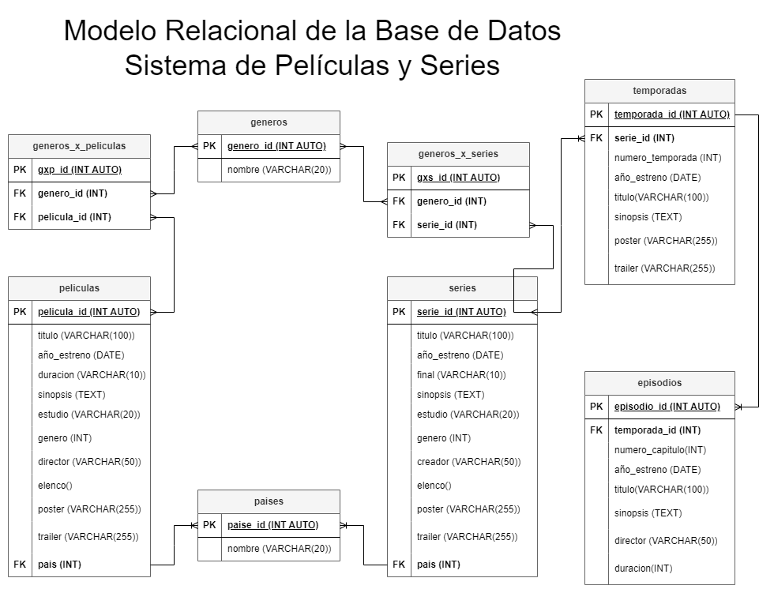

# Sistemas de Peliculas Series

## Listado de entidades

### peliculas **ED**

- pelicula_id **PK**
- titulo 
- año_estreno
- duración
- sinopsis
- estudio
- genero 
- director
- elenco
- poster
- trailer 
- pais **FK**

### series **ED**

- serie_id **PK**
- titulo
- estreno
- final
- sinopsis
- estudio
- creador
- elenco 
- poster 
- treiler
- pais **FK**

### temporadas **ED**
- temporada_id **PK**
- serie_id **FK**
- numero_temporada
- estreno
- titulo
- sinopsis
- poster
- trailer

### episodios **ED**
- episodio_id **PK**
- temporada_id **FK**
- numero_capitulo
- estreno
- titulo
- sinopsis
- director
- duracion

### generos **EC**
- genero_id **PK**
- nombre

### generos_x_series **EP**
- gxs_id **PK**
- genero_id **FK**
- serie_id **FK**

### generos_x_peliculas **EP**
- gxp_id **PK**
- genero_id **FK**
- pelicula_id **FK**

### paises **EC**
- pais_id **PK**
- nombre 

## Relaciones

- Una **pelicula** se estrena en **paises**. (1-M) 
- Una **serie** se estrena en **paises**. (1-M)
- Una **serie** tiene **temporadas**. (1-M)
- Una **temporada** tiene **episodios**. (1-M)
- Muchos **generos** pertenecen a muchas **series**. (M_M)
- Muchos **generos** pertenecen a muchas **peliculas**. (M_M)

## Diagramas 

### Modelo Relacional de la Base de Datos

## Reglas de Negocio

### peliculas
1. Crear una pelicula.
1. Leer una(s) pelicula(s) dada un condicion.
1. Leer todas las peliculas.
1. Actualizar los datos de una pelicula.
1. Eliminar una pelicula.

### series
1. Crear una serie.
1. Leer una(s) serie(s) dada un condicion.
1. Leer todas las series.
1. Actualizar los datos de una serie.
1. Eliminar una serie.

### temporadas
1. Crear una temporada.
1. Leer una(s) temporada(s) dada un condicion.
1. Leer todas las temporadas.
1. Leer a que serie pertenece una temporada. 
1. Actualizar los datos de una temporada.
1. Eliminar una temporada.

### episodios
1. Crear un episodio.
1. Leer un(os) episodio(s) dada un condicion.
1. Leer todos los episodios.
1. Leer a que temporada pertenece un episodio.
1. Actualizar los datos de una episodio.
1. Eliminar una episodio.

### generos 
1. Crear un genero.
1. Eliminar un genero.
1. Actualizar un genero.

### generos_x_series 
1. Crear un gxs.
1. Leer todas las series que pertenecen a un genero.
1. Eliminar un gxs. 
1. Actualizar un gxs.

### generos_x_peliculas 
1. Crear un gxp.
1. Leer todas las peliculas que pertenecen a un genero.
1. Eliminar un gxp. 
1. Actualizar un gxp.

### paises
1. Crear un país.
1. Leer un(os) pais(es) dada una condicion.
1. Leer todos los paises.
1. Eliminar un país.
1. Actualizar un país.