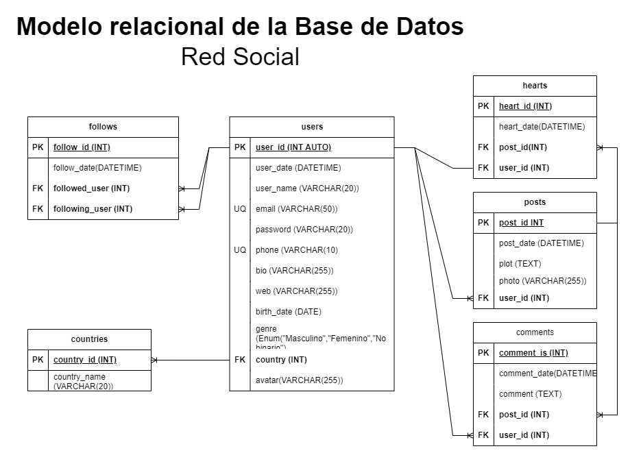

# Red Social para postear fotos

## listado de entidades

### posts **(ED)**
- post_id **(PF)**
- post_date
- plot (descripción)
- photo (URL)
- user_id **(FK)**

### user **(ED)**
- user_id **(PK)**
- user_date (fecha de creación)
- user_name 
- email **(UQ)**
- password
- phone **(UQ)**
- bio
- web (URL)
- avatar (URL de foto)
- birth_date
- genre
- country **(fK)**

### comments **(ED|EP)**
- comment_id **(PK)**
- comment_date
- comment
- post_id **(FK)**
- user_id **(FK)**

### hearts **(ED|EP)**
- heart_id **(PK)**
- heart_date
- post_id **(FK)**
- user_id  **(FK)**

### follows
- follow_id **(PK)**
- follow_date 
- followed_user **(FK)** (a quien sigue)
- following_user **(FK)** (quien realiza el follow)

### countries **(EC)**
- country_id **(PK)**
- country_name 

## Relaciones 

Un **user** publican **posts** (1-M).
Un **user** tiene **countries** (1-M).
Un **user** escriben **comments** (1-M).
Un **post** tiene **comments** (1-M).
Un **user** genera **heart** (1-1).
Un **post** tiene **hearts** (1-M).
Un **user** genera **follows** (1-M).
Un **user** tiene **follows** (1-M).

## Diagramas
### Modelo RElacional De la Base de Datos

## Reglas de negocio 

### usuarios 

1. crear un usuario.
1. eliminar un usuario.
1. Leer un(os) usuario(s) en particular.
1. Leer todos los usuarios.
1. Actualizar datos de un usuario. 
1. Validar un usuario. 
1. Actualizar el password de un usuario.

### posts

1. Crear un post.
1. Eliminar un post.
1. Leer un(os) post(s) en particular.
1. Leer todos los post.
1. Leer que usuario realizo el post.
1. Actualizar el plot (descripción) de un post. 

### comments

1. Crear un comment en un post.
1. Eliminar un comment de un post.
1. Leer un comment de un post.
1. Leer todos los comment de un post.
1. Leer que usuario realizo el comment.
1. Contar el número de comments en un post.
1. Actualizar el comment dentro de un post. 

### hearts

1. Crear un heart de usuario en un post.
1. Eliminar un heart de usuario en un post.
1. Contar el número de hearts en un post.

### follows

1. Crear un follow de un usuario.
1. Eliminar un follow de un usuario.
1. Contar el número de followers de un usuario.
1. Contar el número de followeings de un usuario.

### countries

1. Crear un country.
1. Eliminar un country.
1. Leer un(os) country(s) en particular.
1. Leer todos los country.
1. Actualizar datos de un country. 
